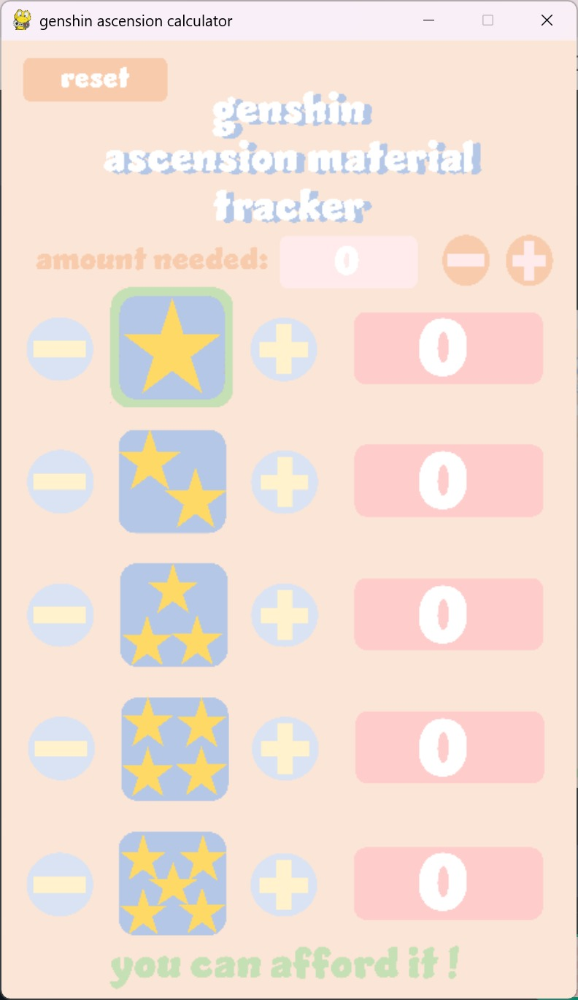
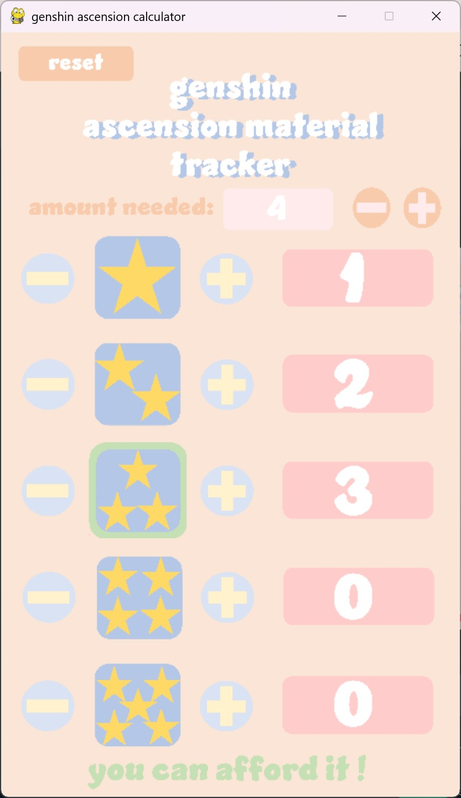
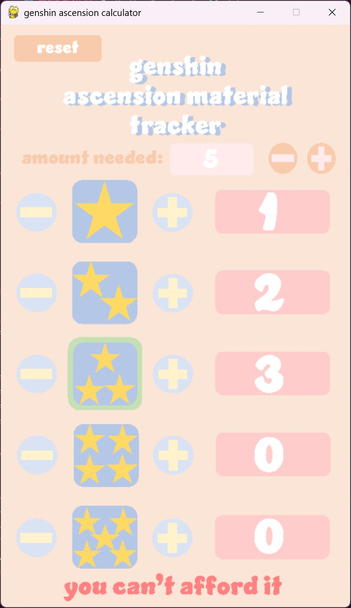

# Genshin Ascension Calculator

A calculator to track if you have enough materials to ascend a weapon/character/talent material without having to manually calculate each time. Small program made to aid played alongside [Genshin Impact](https://genshin.hoyoverse.com/en/).

## Requirements

Install python on your computer:
https://www.python.org/downloads/

Use the package manager [pip](https://pip.pypa.io/en/stable/) to install pygame.

```bash
pip install pygame
```

## Features
- Autosave
- Reset Button
- 1-5 star configuration
- Custom artwork

## How to Use
- Select star level you're aiming for by clicking it
- Press the `+` and `-` buttons at the top to increase the amount needed of that star level
- Use the `+` and `-` below to detail the material counts and values present in your inventory
- The program details below in green/red text whether or whether not you have enough materials to craft the next material rarity up
- No need to save, changes are autosaved and reset with reset button at top left

## File Layout
```
📦project
 ┣ 📂images         <- holds backgrounds, numbers and outline
 ┣ 📂screenshots    <- holds screenshots for the readme file
 ┣ 📜main.pyw       <- the main python file running the tool
 ┗📙readme.md       <- this file describes everything that the game does
```

## Screenshots


